# Design Document

## Overview

This design document outlines the architecture, components, and implementation approach for the comprehensive validation, correction, update, enhancement, and completion of the Multi-Tenant SaaS Task Manager codebase. The validation system follows a 12-phase workflow that systematically validates all backend and frontend files against specification documents.

The validation workflow is designed to:

- Ensure 100% compliance with specifications in `docs/prompt.md`, `docs/build-prompt.md`, `docs/validate-correct-update-enhance-complete.md`, `docs/phase5-controllers-detailed.md`, and `docs/dev-phase-tracker.md`
- Achieve 100% test pass rate and ≥80% code coverage
- Maintain consistency across all related files through cross-validation
- Follow strict phase execution rules with mandatory testing

## Architecture

The validation system follows a phased approach with the following high-level architecture:

```mermaid
flowchart TD
    subgraph "Phase Execution Flow"
        A[Git Status Check] --> B[Branch Creation]
        B --> C[Super Deep Analysis]
        C --> D[Cross Validation Search]
        D --> E[File-by-File Validation]
        E --> F[Issue Documentation]
        F --> G[Implement Corrections]
        G --> H[Add/Update Tests]
        H --> I[Run All Tests]
        I --> J{100% Pass?}
        J -->|No| G
        J -->|Yes| K{Coverage ≥80%?}
        K -->|No| H
        K -->|Yes| L[Update Phase Tracker]
        L --> M[Merge to Main]
    end

    subgraph "Validation Phases"
        P1[Phase 1: Backend Core] --> P2[Phase 2: Backend Models]
        P2 --> P3[Phase 3: Middleware/Validators]
        P3 --> P4[Phase 4: Services/Utils]
        P4 --> P5[Phase 5: Controllers]
        P5 --> P6[Phase 6: Routes]
        P6 --> P7[Phase 7: Frontend Core]
        P7 --> P8[Phase 8: Frontend Features]
        P8 --> P9[Phase 9: Components]
        P9 --> P10[Phase 10: Pages/Routing]
        P10 --> P11[Phase 11: Testing/QA]
        P11 --> P12[Phase 12: Final Integration]
    end
```



## Components and Interfaces

### 1. Phase Execution Engine

The phase execution engine manages the workflow for each validation phase:

```
PhaseExecutionEngine
├── gitStatusCheck()           - Verify branch status, create if needed
├── performSuperDeepAnalysis() - Analyze against all spec documents
├── crossValidationSearch()    - Search across all relevant directories
├── validateFile()             - Validate individual file against specs
├── documentIssues()           - Document issues with WHAT/WHY/HOW
├── implementCorrections()     - Apply fixes using strReplace/fsWrite
├── runTests()                 - Execute npm test with --runInBand
├── checkCoverage()            - Verify ≥80% coverage
├── updatePhaseTracker()       - Update docs/dev-phase-tracker.md
└── mergeBranch()              - Merge to main and cleanup
```

### 2. Cross Validation Scope

Backend directories to validate:

- `backend/config/*`
- `backend/controllers/*`
- `backend/errorHandler/*`
- `backend/middlewares/*`
- `backend/middlewares/validators/*`
- `backend/mock/*`
- `backend/models/*`
- `backend/models/plugins/*`
- `backend/routes/*`
- `backend/scripts/*`
- `backend/services/*`
- `backend/templates/*`
- `backend/utils/*`
- `backend/.env`
- `backend/app.js`
- `backend/server.js`

Frontend directories to validate:

- `client/src/redux/*`
- `client/src/services/*`
- `client/src/hooks/*`
- `client/src/utils/*`
- `client/src/theme/*`
- `client/src/components/*`
- `client/src/pages/*`
- `client/src/layouts/*`
- `client/src/router/*`
- `client/.env`
- `client/src/App.jsx`
- `client/src/main.jsx`

### 3. Issue Documentation Format

```markdown
## Issues Found in [filename]

### Critical Issues

- **WHAT**: [Description of issue]
- **WHY**: [Impact on system]
- **HOW**: [Solution approach]
- **CODE**: [Complete corrected code]

### High Priority Issues

[Same format]

### Medium Priority Issues

[Same format]

### Low Priority Issues

[Same format]
```

### 4. Phase Report Format

```markdown
# Phase [N]: [Phase Name] - Validation Report

## Summary

- Files Validated: [count]
- Issues Found: [count]
- Issues Fixed: [count]
- Tests Added: [count]
- Tests Passing: [count]/[total]
- Coverage: [percentage]%

## Critical Issues Fixed

1. **[Filename]**: [Issue description]
   - **Impact**: [Why this was critical]
   - **Solution**: [How it was fixed]

## Coverage Report

- Statements: [percentage]%
- Branches: [percentage]%
- Functions: [percentage]%
- Lines: [percentage]%

## Phase Completion Status

- [x] All files validated
- [x] All issues corrected
- [x] All tests passing
- [x] Coverage ≥80%
- [x] Phase tracker updated
- [x] Branch merged to main
```

## Data Models

### Phase Tracking Model

The phase tracker (`docs/dev-phase-tracker.md`) maintains:

```
Phase
├── name: String (e.g., "Phase 1: Backend Core Infrastructure")
├── branch: String (e.g., "validate/phase-1-backend-core")
├── status: Enum (⏳ Not Started, 🔄 In Progress, ✅ Complete, ❌ Blocked)
├── files: Array<FileValidation>
├── validationChecklist: Array<ChecklistItem>
├── issuesSummary: { critical: Number, high: Number, medium: Number, low: Number }
└── testCoverage: { statements: Number, branches: Number, functions: Number, lines: Number }

FileValidation
├── path: String
├── validated: Boolean
└── issues: Array<Issue>

Issue
├── severity: Enum (Critical, High, Medium, Low)
├── what: String
├── why: String
├── how: String
└── fixed: Boolean
```

### Validation Configuration

```javascript
const VALIDATION_CONFIG = {
  testTimeout: 30000,
  maxWorkers: 1,
  coverageThreshold: {
    statements: 80,
    branches: 75,
    functions: 80,
    lines: 80,
  },
  gitBranches: {
    phase1: "validate/phase-1-backend-core",
    phase2: "validate/phase-2-backend-models",
    phase3: "validate/phase-3-backend-middleware",
    phase4: "validate/phase-4-backend-services",
    phase5: "validate/phase-5-backend-controllers",
    phase6: "validate/phase-6-backend-routes",
    phase7: "validate/phase-7-frontend-core",
    phase8: "validate/phase-8-frontend-features",
    phase9: "validate/phase-9-frontend-components",
    phase10: "validate/phase-10-frontend-pages",
    phase11: "validate/phase-11-testing-qa",
    phase12: "validate/phase-12-final-integration",
  },
};
```

## Correctness Properties

_A property is a characteristic or behavior that should hold true across all valid executions of a system-essentially, a formal statement about what the system should do. Properties serve as the bridge between human-readable specifications and machine-verifiable correctness guarantees._

Based on the prework analysis, the validation requirements are primarily example-based checks rather than universal properties. The validation system verifies specific file contents against specifications. However, we can identify the following correctness properties:

### Property 1: Cross-Validation Consistency

_For any_ change made to a file during validation, all related files across the cross-validation scope that reference or depend on that file SHALL be checked for consistency.
**Validates: Requirements 8.1, 8.2, 8.3, 8.4**

### Property 2: Test Pass Rate Invariant

_For any_ phase completion, the test pass rate SHALL be exactly 100% - no phase can be marked complete with failing tests.
**Validates: Requirements 9.6, 9.7, 27.4**

### Property 3: Coverage Threshold Invariant

_For any_ phase completion, the code coverage SHALL be at least 80% for statements, functions, and lines, and at least 75% for branches.
**Validates: Requirements 20.5, 27.5**

### Property 4: Constants Consistency

_For any_ constant value used in the frontend (`client/src/utils/constants.js`), the value SHALL exactly match the corresponding constant in the backend (`backend/utils/constants.js`).
**Validates: Requirements 16.7, 23.5**

### Property 5: Soft Delete Plugin Application

_For any_ Mongoose model in `backend/models/`, the model SHALL have the soft delete plugin applied with all required fields (isDeleted, deletedAt, deletedBy, restoredAt, restoredBy).
**Validates: Requirements 11.3, 22.8, 28.9**

### Property 6: Transaction Usage for Write Operations

_For any_ controller function that performs write operations (create, update, delete, restore), the function SHALL use MongoDB transactions with proper session management.
**Validates: Requirements 14.3, 22.10, 28.10**

### Property 7: Authorization Matrix Enforcement

_For any_ protected route, the authorization middleware SHALL correctly enforce the scope defined in `backend/config/authorizationMatrix.json` where Platform SuperAdmin has `crossOrg` scope ONLY for the Organization resource.
**Validates: Requirements 10.4, 12.4, 14.3**

### Property 8: HTTP-Only Cookie Authentication

_For any_ JWT token (access or refresh), the token SHALL be stored in HTTP-only cookies and SHALL NOT be stored in localStorage or returned in response body.
**Validates: Requirements 14.4, 21.5**

### Property 9: Task Type Restrictions

_For any_ RoutineTask, the status SHALL NOT be "To Do" and the priority SHALL NOT be "Low".
**Validates: Requirements 5.6, 11.9, 12.8, 14.7**

### Property 10: HOD Watcher Restriction

_For any_ ProjectTask, all users in the watchers array SHALL have `isHod: true`.
**Validates: Requirements 5.5, 11.6, 14.7**

## Error Handling

### Validation Error Categories

1. **Critical Errors**: Security vulnerabilities, data integrity issues, authentication/authorization bypasses

   - Must be fixed immediately
   - Block phase completion

2. **High Priority Errors**: Business logic violations, specification mismatches, missing required functionality

   - Must be fixed before phase completion
   - May affect other components

3. **Medium Priority Errors**: Performance issues, code quality problems, missing edge case handling

   - Should be fixed during the phase
   - May be deferred with documentation

4. **Low Priority Errors**: Style inconsistencies, minor optimizations, documentation gaps
   - Can be fixed during the phase
   - May be deferred to later phases

### Error Recovery Strategy

1. **Test Failures**: Fix the underlying code issue, not the test
2. **Coverage Gaps**: Add tests for uncovered code paths
3. **Lint Errors**: Apply automatic fixes where possible, manual fixes otherwise
4. **Build Errors**: Resolve dependency and syntax issues before proceeding

## Testing Strategy

### Dual Testing Approach

The validation system uses both unit testing and property-based testing:

**Unit Tests**:

- Verify specific examples and edge cases
- Test individual functions and components
- Validate error conditions and boundary values
- Located in `backend/tests/unit/` and `client/src/__tests__/`

**Property-Based Tests**:

- Verify universal properties across all inputs
- Use fast-check library for backend
- Test authorization matrix exhaustively
- Test soft delete operations
- Test cascade operations
- Located in `backend/tests/property/`

### Testing Configuration

**Backend (Jest)**:

```javascript
// jest.config.js
export default {
  testEnvironment: "node",
  transform: {},
  extensionsToTreatAsEsm: [".js"],
  testMatch: ["**/tests/**/*.test.js"],
  testTimeout: 30000,
  maxWorkers: 1,
  collectCoverageFrom: [
    "**/*.js",
    "!**/node_modules/**",
    "!**/coverage/**",
    "!**/tests/**",
  ],
  coverageThreshold: {
    global: {
      statements: 80,
      branches: 75,
      functions: 80,
      lines: 80,
    },
  },
};
```

**Frontend (Vitest)**:

```javascript
// vite.config.js
export default {
  test: {
    environment: "jsdom",
    globals: true,
    setupFiles: ["./src/__tests__/setup.js"],
  },
};
```

### Test Execution Rules

1. Use Real MongoDB test database (NOT mongodb-memory-server)
2. Run tests with `--runInBand` flag for sequential execution
3. NEVER skip a test, no matter how long it takes
4. NEVER skip a failed test - fix it before proceeding
5. Run `npm test` at the END of EACH phase
6. ALL tests MUST pass before phase completion

### Property-Based Test Annotations

Each property-based test MUST be annotated with:

```javascript
/**
 * **Feature: codebase-validation, Property 1: Cross-Validation Consistency**
 * **Validates: Requirements 8.1, 8.2, 8.3, 8.4**
 */
```

### Coverage Requirements

| Metric     | Minimum Threshold |
| ---------- | ----------------- |
| Statements | 80%               |
| Branches   | 75%               |
| Functions  | 80%               |
| Lines      | 80%               |

### Test Categories by Phase

| Phase    | Test Focus                                            |
| -------- | ----------------------------------------------------- |
| Phase 1  | Config validation, error handling, utility functions  |
| Phase 2  | Model schemas, soft delete plugin, cascade operations |
| Phase 3  | Authentication, authorization, request validation     |
| Phase 4  | Email service, notifications, Socket.IO               |
| Phase 5  | Controller business logic, transactions               |
| Phase 6  | Route middleware chains, endpoint accessibility       |
| Phase 7  | Redux store, RTK Query, Socket.IO client              |
| Phase 8  | Feature APIs, slices, cache invalidation              |
| Phase 9  | Component rendering, MUI patterns                     |
| Phase 10 | Page routing, lazy loading, protected routes          |
| Phase 11 | Test configuration, coverage verification             |
| Phase 12 | Integration tests, build verification                 |
