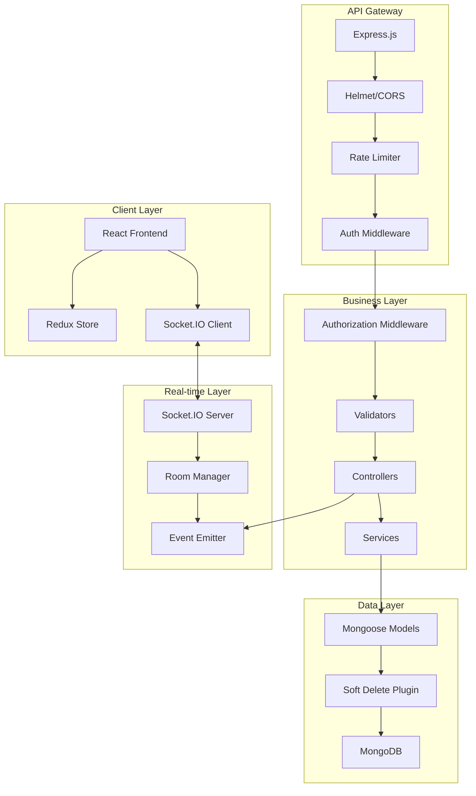

# Design Document

## Overview

This design document outlines the architecture, components, and implementation approach for validating, correcting, and completing the Multi-Tenant SaaS Task Manager codebase to production readiness. The system follows a strict hierarchy (Organization → Department → User) with JWT-based authentication, role-based authorization, and universal soft delete.

**Execution Phases:**

- **Phase 1.1**: Backend Core Components (Configuration, Models, Plugins, Utils)
- **Phase 1.2**: Backend Resource Modules (Controllers, Routes, Services)
- **Phase 2**: Frontend (Components, Pages, Redux, Services)

> [!IMPORTANT] > **Critical Implementation Rules (STRICTLY ENFORCED)**
>
> **#1 MANDATORY: WHAT-WHY-HOW Analysis (APPLIES TO EVERY CHANGE)**
>
> Before making ANY change/update to ANY file:
>
> 1. **WHAT exists?** - First identify what currently exists in the codebase (both backend and frontend)
>
>    - Read the existing file completely
>    - Understand current implementation
>    - Identify current patterns and structure
>    - Document current behavior
>
> 2. **WHY change?** - Justify the change
>
>    - What requirement necessitates this change?
>    - What problem does it solve?
>    - What will break if we don't change it?
>    - Is it aligned with production readiness requirements?
>
> 3. **HOW to change?** - Plan the implementation
>    - How will the change be implemented?
>    - How does it respect existing codebase structure?
>    - How does it integrate with existing patterns?
>    - What tests will verify the change?
>
> **The existing codebase MUST be respected.** Do not impose arbitrary patterns. Work WITH the existing architecture, not against it.
>
> **To install any new packages that doesn't exist in backend/package.json and client/package.json, ask the user as yes or no. If the user provide yes, install the package and proceed accordingly and if the user provide no, then proceed to validate and correct without using a package.**

## Architecture



## Components and Interfaces

### Backend Components

#### 1. Soft Delete Plugin (`backend/models/plugins/softDelete.js`)

```javascript
// Interface
{
  // Instance Methods
  softDelete(deletedBy: ObjectId): Promise<Document>
  restore(): Promise<Document>

  // Static Methods
  softDeleteById(id: ObjectId, deletedBy?: ObjectId): Promise<Document>
  softDeleteMany(filter: Object, deletedBy?: ObjectId): Promise<UpdateResult>
  restoreById(id: ObjectId): Promise<Document></Document>oreMany(filter: Object): Promise<UpdateResult>

  // Query Helpers
  withDeleted(): Query
  onlyDeleted(): Query
}

// Schema Fields Added
{
  isDeleted: { type: Boolean, default: false, index: true },
  deletedAt: { type: Date, default: null },
  deletedBy: { type: ObjectId, ref: 'User', default: null }
}
```

#### 2. Authorization Middleware (`backend/middlewares/authorization.js`)

```javascript
// Interface
authorize(resource: string, operation: string): Middleware
checkOwnership(resource: string, document: Document, user: User): boolean
getPermissions(role: string, resource: string): string[]

// Ownership Fields by Resource
{
  tasks: ['createdBy', 'assignees'],
  attachments: ['uploadedBy'],
  comments: ['createdBy'],
  activities: ['createdBy'],
  notifications: ['recipients'],
  materials: ['createdBy', 'uploadedBy'],
  vendors: ['createdBy']
}
```

#### 3. Cascade Operations (`backend/utils/helpers.js`)

```javascript
// Interface
cascadeDelete(model: string, id: ObjectId, session: ClientSession, depth?: number): Promise<void>
cascadeRestore(model: string, id: ObjectId, session: ClientSession): Promise<void>

// Cascade Relationships
Organization → [Departments, Users, Tasks, Materials, Vendors]
Department → [Users, Tasks]
Task → [Comments, Activities, Attachments]
User → [Tasks (created), Comments, Activities]
```

#### 4. Token Generation (`backend/utils/generateTokens.js`)

```javascript
// Interface
generateAccessToken(user: User): string  // 15min expiry
generateRefreshToken(user: User): string // 7 days expiry
verifyAccessToken(token: string): TokenPayload
verifyRefreshToken(token: string): TokenPayload
```

### Frontend Components

#### 1. Error Boundary (`client/src/components/common/ErrorBoundary.jsx`)

```javascript
// Props Interface
{
  children: ReactNode,
  fallback?: ReactNode,
  onError?: (error: Error, errorInfo: ErrorInfo) => void
}
```

#### 2. Socket Service (`client/src/services/socketService.js`)

```javascript
// Interface
{
  connect(): void
  disconnect(): void
  on(event: string, handler: Function): void
  off(event: string, handler: Function): void
  emit(event: string, data: any): void
  joinRoom(room: string): void
  leaveRoom(room: string): void
}
```

## Data Models

### Platform Identification Fields

```javascript
// Organization Model
{
  isPlatformOrg: { type: Boolean, default: false, index: true }
}

// User Model
{
  isPlatformUser: { type: Boolean, default: false, index: true },
  isHod: { type: Boolean, default: false }
}
```

### TTL Configuration

```javascript
// TTL Expiry Periods (in seconds)
{
  MATERIALS: 90 * 24 * 60 * 60,      // 90 days
  VENDORS: 90 * 24 * 60 * 60,        // 90 days
  TASKS: 180 * 24 * 60 * 60,         // 180 days
  USERS: 365 * 24 * 60 * 60,         // 365 days
  DEPARTMENTS: 365 * 24 * 60 * 60,   // 365 days
  ORGANIZATIONS: null,               // Never auto-delete
  ATTACHMENTS: 30 * 24 * 60 * 60,    // 30 days
  COMMENTS: 180 * 24 * 60 * 60,      // 180 days
  ACTIVITIES: 90 * 24 * 60 * 60,     // 90 days
  NOTIFICATIONS: 30 * 24 * 60 * 60   // 30 days
}
```

## Correctness Properties

_A property is a characteristic or behavior that should hold true across all valid executions of a system-essentially, a formal statement about what the system should do. Properties serve as the bridge between human-readable specifications and machine-verifiable correctness guarantees._

### Property 1: Soft Delete Plugin Prevents Hard Deletes

_For any_ model using the soft delete plugin, calling native delete methods (remove, deleteOne, deleteMany, findByIdAndDelete) SHALL throw an error, and the document SHALL remain in the database with isDeleted unchanged.

**Validates: Requirements 4.1, 7.1**

### Property 2: Soft Delete Query Filtering

_For any_ model using the soft delete plugin and any find query without withDeleted(), the result SHALL NOT include documents where isDeleted is true.

**Validates: Requirements 4.2, 7.2**

### Property 3: Soft Delete State Transitions

_For any_ document, calling softDeleteById SHALL set isDeleted to true and deletedAt to a timestamp, and calling restoreById SHALL set isDeleted to false and deletedAt to null.

**Validates: Requirements 4.4, 4.5, 7.5**

### Property 4: Organization Cascade Delete Completeness

_For any_ organization that is soft-deleted, ALL child resources (departments, users, tasks, materials, vendors) SHALL also be soft-deleted within the same transaction.

**Validates: Requirements 8.1, 9.5**

### Property 5: Department Cascade Delete Completeness

_For any_ department that is soft-deleted, ALL tasks and users in that department SHALL also be soft-deleted within the same transaction.

**Validates: Requirements 8.2, 10.4**

### Property 6: Task Cascade Delete Completeness

_For any_ task that is soft-deleted, ALL comments, activities, and attachments for that task SHALL also be soft-deleted within the same transaction.

**Validates: Requirements 8.3, 11.6**

### Property 7: Cascade Transaction Atomicity

_For any_ cascade delete operation, if any child deletion fails, the entire operation SHALL be rolled back and no documents SHALL be modified.

**Validates: Requirements 8.4, 8.5**

### Property 8: Restore Parent Validation

_For any_ child resource restoration attempt, if the parent resource is soft-deleted, the restoration SHALL fail with an appropriate error.

**Validates: Requirements 8.6**

### Property 9: Platform SuperAdmin Cross-Org Access

_For any_ user where isPlatformUser is true AND role is SuperAdmin, authorization checks for cross-organization read operations SHALL succeed.

**Validates: Requirements 10.1, 24.4**

### Property 10: Customer User Organization Isolation

_For any_ user where isPlatformUser is false, authorization checks for resources in other organizations SHALL fail with 403 error.

**Validates: Requirements 10.2, 24.3**

### Property 11: Ownership Verification Correctness

_For any_ resource with ownership fields, the "own" permission check SHALL return true only if the user's ID matches one of the ownership fields (createdBy, uploadedBy, assignees, recipients, watchers).

**Validates: Requirements 10.3, 10.4, 24.8-24.15**

### Property 12: Authorization Error Code Correctness

_For any_ authorization failure, the system SHALL return HTTP 403 (Forbidden), not 401 (Unauthorized).

**Validates: Requirements 10.5, 74.5**

### Property 13: Password Security

_For any_ user password stored in the database, it SHALL be hashed using bcrypt with at least 12 salt rounds, and the original password SHALL NOT be recoverable.

**Validates: Requirements 8.1, 31.1**

### Property 14: Sensitive Field Exclusion

_For any_ user query result, the fields password, refreshToken, and refreshTokenExpiry SHALL NOT be present unless explicitly selected.

**Validates: Requirements 8.4, 31.2**

### Property 15: UTC Date Storage

_For any_ date field stored in the database, the value SHALL be in UTC timezone.

**Validates: Requirements 33.1, 33.3, 33.4**

### Property 16: ISO Date Response Format

_For any_ API response containing date fields, the dates SHALL be formatted in ISO 8601 format.

**Validates: Requirements 33.5**

### Property 17: TTL Cleanup Correctness

_For any_ soft-deleted resource (except Organizations), after the TTL expiry period, the document SHALL be permanently deleted from the database.

**Validates: Requirements 11.1, 11.2, 11.3, 11.4**

### Property 18: Organization TTL Exemption

_For any_ soft-deleted Organization, the document SHALL NEVER be automatically deleted by TTL cleanup.

**Validates: Requirements 11.5**

### Property 19: Token Synchronization

_For any_ token refresh operation, both HTTP and Socket.IO tokens SHALL be refreshed simultaneously, and both SHALL use the same JWT secrets.

**Validates: Requirements 9.1, 9.2, 28.9, 28.10, 28.11**

## Error Handling

### Backend Error Handling

```javascript
// CustomError Class
class CustomError extends Error {
  constructor(message, statusCode, errorCode) {
    super(message);
    this.statusCode = statusCode;
    this.errorCode = errorCode;
    this.isOperational = true;
  }
}

// Error Codes
{
  UNAUTHORIZED: 401,        // Authentication failure
  FORBIDDEN: 403,           // Authorization failure
  NOT_FOUND: 404,           // Resource not found
  VALIDATION_ERROR: 400,    // Input validation failure
  CONFLICT: 409,            // Resource conflict
  INTERNAL_ERROR: 500       // Server error
}
```

### Frontend Error Handling

```javascript
// Error Boundary Strategy
- Root-level: Catch all unhandled errors, display error page
- Route-level: Catch route-specific errors, display RouteError
- Component-level: Catch component errors, display fallback UI

// API Error Handling
- 401: Automatically logout user, redirect to login
- 403: Display error toast, do NOT logout
- 4xx: Display validation/error message
- 5xx: Display generic error message, log to service
```

## Testing Strategy

### Property-Based Testing Library

**Library:** fast-check (npm package)

**Configuration:**

- Minimum iterations: 100 per property
- Seed: Configurable for reproducibility

### Test Structure

```
backend/tests/
├── unit/
│   ├── models/
│   │   ├── softDelete.test.js
│   │   ├── user.test.js
│   │   ├── organization.test.js
│   │   └── ...
│   ├── middlewares/
│   │   ├── auth.test.js
│   │   ├── authorization.test.js
│   │   └── ...
│   ├── controllers/
│   │   └── ...
│   └── utils/
│       ├── helpers.test.js
│       ├── generateTokens.test.js
│       └── ...
├── integration/
│   ├── auth.test.js
│   ├── cascade.test.js
│   └── ...
├── property/
│   ├── softDelete.property.test.js
│   ├── cascade.property.test.js
│   ├── authorization.property.test.js
│   └── ...
└── setup.js
```

### Property Test Format

Each property-based test MUST include:

1. Comment referencing the correctness property: `**Feature: production-readiness-validation, Property {number}: {property_text}**`
2. Generator for test data
3. Property assertion
4. Minimum 100 iterations

### Unit Test Requirements

- Test each controller function
- Test each model method and static
- Test each middleware function
- Test each utility function
- Mock external dependencies (MongoDB, Cloudinary, Email)

### Integration Test Requirements

- Test complete request/response cycles
- Test cascade operations end-to-end
- Test authentication flows
- Test authorization scenarios
- Use transactions for database isolation

### Coverage Requirements

- Minimum 80% code coverage
- All critical paths covered
- All error paths covered

## Middleware Configuration

### Middleware Order (Critical)

```javascript
// backend/app.js - EXACT ORDER REQUIRED
1. helmet()                    // Security headers first
2. cors(corsOptions)           // CORS handling
3. cookieParser()              // Parse cookies
4. express.json({ limit: '10mb' })  // Parse JSON
5. mongoSanitize()             // NoSQL injection prevention
6. compression({ threshold: 1024 }) // Response compression (1KB threshold)
7. requestIdMiddleware()       // Request tracing
8. rateLimiter()               // Rate limiting (production)
9. routes                      // API routes
10. errorHandler               // Global error handler (LAST)
```

### Helmet CSP Configuration

```javascript
{
  directives: {
    defaultSrc: ["'self'"],
    imgSrc: ["'self'", "data:", "https://res.cloudinary.com"],
    scriptSrc: ["'self'"],
    styleSrc: ["'self'", "'unsafe-inline'"],
    connectSrc: ["'self'", "wss:", "https://res.cloudinary.com"]
  }
}
```

### CORS Configuration

```javascript
{
  origin: allowedOrigins,  // From config/allowedOrigins.js
  credentials: true,       // Enable cookies
  methods: ['GET', 'POST', 'PUT', 'PATCH', 'DELETE'],
  allowedHeaders: ['Content-Type', 'Authorization']
}
```

### Rate Limiter Configuration

```javascript
// General API
{
  windowMs: 15 * 60 * 1000,  // 15 minutes
  max: 100                    // 100 requests per window
}

// Auth Endpoints
{
  windowMs: 15 * 60 * 1000,  // 15 minutes
  max: 5                      // 5 requests per window
}
```

## Server Configuration

### Environment Validation

```javascript
// Required Environment Variables
const REQUIRED_ENV = [
  "MONGODB_URI",
  "JWT_ACCESS_SECRET",
  "JWT_REFRESH_SECRET",
  "CLIENT_URL",
  "PORT",
];

// Optional but Recommended
const OPTIONAL_ENV = [
  "SMTP_HOST",
  "SMTP_PORT",
  "SMTP_USER",
  "SMTP_PASS",
  "CLOUDINARY_CLOUD_NAME",
  "CLOUDINARY_API_KEY",
  "CLOUDINARY_API_SECRET",
];
```

### Graceful Shutdown

```javascript
// Shutdown sequence
1. Stop accepting new connections
2. Close Socket.IO connections
3. Close HTTP server
4. Close MongoDB connection
5. Exit process

// Signal handlers
process.on('SIGTERM', gracefulShutdown);
process.on('SIGINT', gracefulShutdown);
```

### Health Check Endpoint

```javascript
// GET /health
{
  status: 'ok' | 'error',
  database: 'connected' | 'disconnected',
  timestamp: ISO8601,
  uptime: seconds
}
```

## MongoDB Configuration

### Connection Options

```javascript
{
  minPoolSize: 5,
  maxPoolSize: 50,
  serverSelectionTimeoutMS: 5000,
  socketTimeoutMS: 45000,
  retryWrites: true,
  retryReads: true,
  w: 'majority',
  readPreference: 'primaryPreferred'
}
```

### Retry Logic

```javascript
// Exponential backoff
{
  maxRetries: 5,
  initialDelay: 1000,  // 1 second
  maxDelay: 30000,     // 30 seconds
  factor: 2            // Double each retry
}
```

## Model Schemas

### Organization Schema

```javascript
{
  name: { type: String, required: true, maxlength: 100 },
  description: { type: String, maxlength: 2000 },
  industry: { type: String, enum: INDUSTRIES },
  address: String,
  phone: String,
  email: { type: String, validate: emailValidator },
  isPlatformOrg: { type: Boolean, default: false, index: true },
  owner: { type: ObjectId, ref: 'User' },
  createdBy: { type: ObjectId, ref: 'User' },
  // Soft delete fields via plugin
  isDeleted: Boolean,
  deletedAt: Date,
  deletedBy: { type: ObjectId, ref: 'User' }
}

// Indexes
{ name: 1 }  // Unique
{ isPlatformOrg: 1 }
{ isDeleted: 1 }
```

### User Schema

```javascript
{
  firstName: { type: String, required: true, maxlength: 20 },
  lastName: { type: String, required: true, maxlength: 20 },
  email: { type: String, required: true, maxlength: 50 },
  password: { type: String, required: true, select: false },
  role: { type: String, enum: USER_ROLES, required: true },
  position: { type: String, maxlength: 50 },
  phone: String,
  employeeId: Number,
  profilePicture: { url: String, publicId: String },
  skills: [{ name: String, proficiency: Number }],
  status: { type: String, enum: ['online', 'offline', 'away'] },
  organization: { type: ObjectId, ref: 'Organization', required: true },
  department: { type: ObjectId, ref: 'Department', required: true },
  isPlatformUser: { type: Boolean, default: false, index: true },
  isHod: { type: Boolean, default: false },
  refreshToken: { type: String, select: false },
  refreshTokenExpiry: { type: Date, select: false },
  lastLogin: Date,
  failedLoginAttempts: { type: Number, default: 0 },
  lockUntil: Date,
  // Soft delete fields
  isDeleted: Boolean,
  deletedAt: Date,
  deletedBy: { type: ObjectId, ref: 'User' }
}

// Indexes
{ email: 1, organization: 1 }  // Unique compound
{ organization: 1 }
{ department: 1 }
{ isPlatformUser: 1 }
{ isDeleted: 1 }
```

### Department Schema

```javascript
{
  name: { type: String, required: true, maxlength: 100 },
  description: { type: String, maxlength: 2000 },
  organization: { type: ObjectId, ref: 'Organization', required: true },
  manager: { type: ObjectId, ref: 'User' },
  createdBy: { type: ObjectId, ref: 'User' },
  // Soft delete fields
  isDeleted: Boolean,
  deletedAt: Date,
  deletedBy: { type: ObjectId, ref: 'User' }
}

// Indexes
{ name: 1, organization: 1 }  // Unique compound
{ organization: 1 }
{ isDeleted: 1 }
```

### BaseTask Schema (Discriminator Base)

```javascript
{
  title: { type: String, required: true, maxlength: 50 },
  description: { type: String, maxlength: 2000 },
  status: { type: String, enum: TASK_STATUS },
  priority: { type: String, enum: TASK_PRIORITY },
  dueDate: Date,
  tags: [{ type: String, maxlength: 20 }],  // Max 5
  organization: { type: ObjectId, ref: 'Organization', required: true },
  department: { type: ObjectId, ref: 'Department', required: true },
  createdBy: { type: ObjectId, ref: 'User', required: true },
  updatedBy: { type: ObjectId, ref: 'User' },
  taskType: { type: String, required: true },  // Discriminator key
  // Soft delete fields
  isDeleted: Boolean,
  deletedAt: Date,
  deletedBy: { type: ObjectId, ref: 'User' }
}
```

### ProjectTask Schema (Extends BaseTask)

```javascript
{
  estimatedCost: Number,
  actualCost: Number,
  currency: { type: String, default: 'USD' },
  costHistory: [{
    amount: Number,
    date: Date,
    updatedBy: { type: ObjectId, ref: 'User' }
  }],  // Max 200
  materials: [{
    material: { type: ObjectId, ref: 'Material' },
    quantity: Number
  }],  // Max 20
  assignees: [{ type: ObjectId, ref: 'User' }],  // Max 20
  watchers: [{ type: ObjectId, ref: 'User' }]    // Max 20
}
```

## Authorization Matrix

```javascript
const AUTHORIZATION_MATRIX = {
  SuperAdmin: {
    scope: {
      own: ["read", "write", "delete"],
      ownDept: ["read", "write", "delete"],
      crossDept: ["read"],
      crossOrg: ["read", "write", "delete"], // Platform only
    },
    resources: {
      users: ["create", "read", "update", "delete", "restore"],
      departments: ["create", "read", "update", "delete", "restore"],
      organizations: ["create", "read", "update", "delete", "restore"],
      tasks: ["create", "read", "update", "delete", "restore"],
      materials: ["create", "read", "update", "delete", "restore"],
      vendors: ["create", "read", "update", "delete", "restore"],
      notifications: ["read", "update", "delete"],
      attachments: ["create", "read", "delete"],
    },
  },
  Admin: {
    scope: {
      own: ["read", "write", "delete"],
      ownDept: ["read", "write", "delete"],
      crossDept: ["read"],
      crossOrg: [],
    },
    resources: {
      users: ["create", "read", "update", "delete"],
      departments: ["read"],
      organizations: ["read"],
      tasks: ["create", "read", "update", "delete"],
      materials: ["create", "read", "update", "delete"],
      vendors: ["create", "read", "update", "delete"],
      notifications: ["read", "update", "delete"],
      attachments: ["create", "read", "delete"],
    },
  },
  Manager: {
    scope: {
      own: ["read", "write", "delete"],
      ownDept: ["read", "write"],
      crossDept: ["read"],
      crossOrg: [],
    },
    resources: {
      users: ["read", "update"],
      departments: ["read"],
      organizations: ["read"],
      tasks: ["create", "read", "update", "delete"],
      materials: ["create", "read", "update"],
      vendors: ["read", "update"],
      notifications: ["read", "update"],
      attachments: ["create", "read", "delete"],
    },
  },
  User: {
    scope: {
      own: ["read", "write"],
      ownDept: ["read"],
      crossDept: [],
      crossOrg: [],
    },
    resources: {
      users: ["read"],
      departments: ["read"],
      organizations: ["read"],
      tasks: ["create", "read", "update"],
      materials: ["read"],
      vendors: ["read"],
      notifications: ["read", "update"],
      attachments: ["create", "read"],
    },
  },
};
```

## Frontend Architecture

### Redux Store Structure

```javascript
{
  auth: {
    user: User | null,
    isAuthenticated: boolean,
    isLoading: boolean
  },
  [api.reducerPath]: RTKQueryCache,
  _persist: PersistState
}
```

### RTK Query Tags

```javascript
const TAGS = [
  "Task",
  "TaskActivity",
  "TaskComment",
  "User",
  "Organization",
  "Department",
  "Material",
  "Vendor",
  "Notification",
  "Attachment",
];
```

### Socket.IO Events

```javascript
// Client → Server
"join:user", "join:department", "join:organization";
"leave:user", "leave:department", "leave:organization";
("status:update");

// Server → Client
"task:created", "task:updated", "task:deleted", "task:restored";
"activity:created", "activity:updated", "activity:deleted";
"comment:created", "comment:updated", "comment:deleted";
"notification:new", "notification:read";
("user:status");
```

## API Response Format

```javascript
// Success Response
{
  success: true,
  data: any,
  pagination?: {
    page: number,      // 1-based
    limit: number,
    totalCount: number,
    totalPages: number,
    hasNext: boolean,
    hasPrev: boolean
  }
}

// Error Response
{
  success: false,
  message: string,
  errorCode: string,
  stack?: string  // Development only
}
```

## Validation Rules

### Common Validation Patterns

```javascript
// MongoDB ObjectId
param("id").isMongoId().withMessage("Invalid ID format");

// Email
body("email").isEmail().normalizeEmail().isLength({ max: 50 });

// Password
body("password")
  .isLength({ min: 8 })
  .withMessage("Password must be at least 8 characters");

// Enum
body("status").isIn(TASK_STATUS).withMessage("Invalid status");

// Array with max length
body("tags").isArray({ max: 5 }).withMessage("Maximum 5 tags allowed");
```
